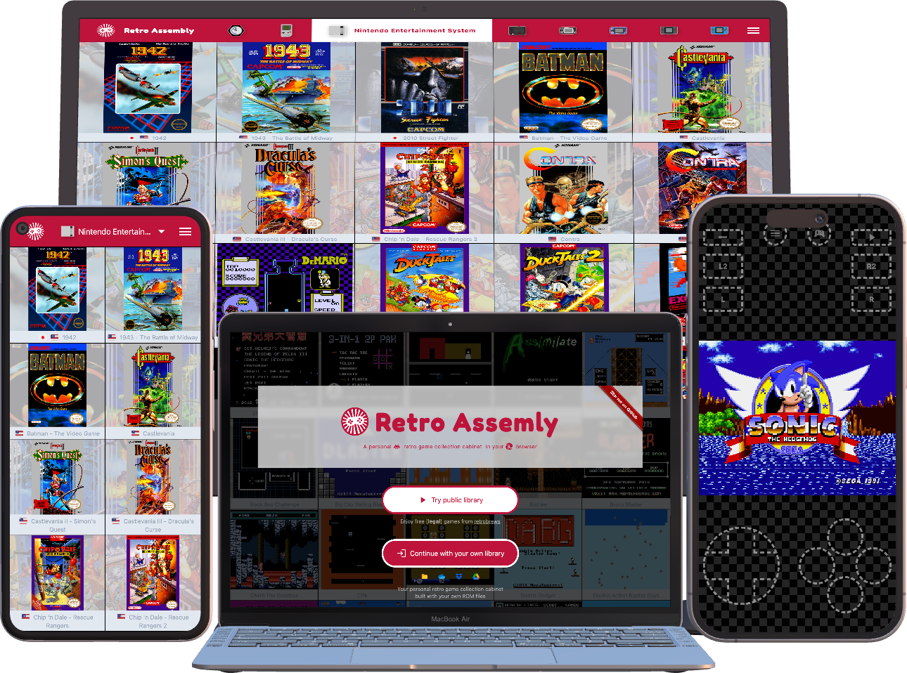
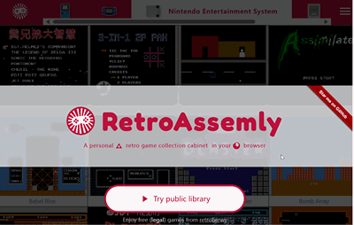
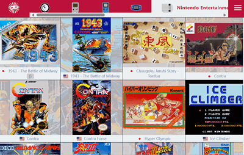

  
  <h1 align="center">RetroAssembly</h1>

## Overview
A personal retro game collection cabinet in your browser.

  

## Usage
1. Visit [retroassembly.com](https://retroassembly.com).
2. Pick a method you prefer to provide your ROMs. For BIOS files, place them into a directory named `system` inside the directory you are picking.

   You can also try the public library first if you do not have one now.
5. Start to play!

## Features
+ 📁 Import a directory from your local directory or cloud drive, then a game list will appear

  
+ 🖼️ Automatically grab game boxarts.

  
+ 🎮 Joystick friendly, no need to switch between joysticks and mouse while navigating through different games or consoles

  
+ 💾 Save states and sync them to with different devices (if using a cloud disk we support)

  
+ 📱 Virtual controller for mobile devices
+ 🍎 Super convenient for iOS/iPadOS, no AltStore/jailbreak required. Either play directly in your browser or add it to home screen.

## Motivation
### I love retro games and emulators
I love retro games and emulators. I used to be addicted to configuring my emulators on desktops, laptops, phones, and tablets...

I also spent a lot of time on flashing images for my Raspberry Pi and other hardwares. You may already hear of something like Lakka, RetroPie, Batocera.linux, EmuELEC, etc.

I loved these.

However, I faced some problems with these software and system. Although maybe some of them are not the problems with these software programs, they may be my own issues.

### My problems with RetroArch / Pegasus / BizHawk / RetroPie / standalone emulators etc

1. #### I spent a lot of time on configuring them.
    I had been spending too much time configuring these software and system, as well as much time on configuring and updating the emulators. But as comparisons, I spent only a little time on playing the games.

    As I tried to update my configuations for several times, sometimes the systems would be broken by my invalid configuations and I have to reinstall them, and then my saves got lost, as a result.

2. #### I could not synchronize my progress easily.
    After saving my game progress on my PC, I am unable to continue it directly on my phone. Maybe copying save files manually would work, but it could be very annoying if I had to do that every time.

Then I began searching for a software that could solve these problems, but the results were not ideal.

### Searching for projects that can deal with my problems
Some of the emulator related softwares only work on a certain platform. While some of them, like RetroArch, are cross platform applications; however, it is difficult to install them on an iPhone or iPad. Synchronizing progress is also a painful problem.

Again, I began searching for some web based projects other than native programs. I don't want to use commercial websites providing illegal ROMs because I want to use my own. Another reason for not using them is that I don't want to put my save files on their servers since they may disappear some day. I want to keep the ownership.

I found some decent projects (see [Alternatives](#alternatives)), but none of them met all my expectations. Here are some of my expectations:

+ It should be web based. So I can use it on every device with a web browser: phones, tablets, even Chromebooks.
+ It should be super easy to use. Give it a ROM directory, and everything else will function properly.
+ It should show some boxarts instead of plain game titles. I don't want to download them manually, they should be shown automatically.
+ It should help me keep my progress files synchronized.
+ It should be joystick friendly. Navigating through games should be as smooth as on a video game console, and keyboards and mouses should be optional. This way, when I exit a game and start another, I can keep my hands on my controller.
+ It should have touch control support. When I am outside, I can enjoy playing games on my phone using my fingers. Though it's not that efficient.

### Creating RetroAssembly
Finally, I realized that although I don't know much about emulator development, I do have some experience with web development. And I have heard that there are already Emscripten builds of RetroArch that can run within browsers. I believe I can utilize this to create my own project.

Then I began working on this project called RetroAssembly. The meaning of this project name is to assemble all my retro games here (it has nothing to do with WebAssembly though WebAssembly is used by RetroArch Emscripten builds under the hood😆). In addition to that, I have also created a JavaScript library [Nostalgist.js](https://github.com/arianrhodsandlot/nostalgist) during the development of RetroAssembly.

I've used RetroAssembly personally for months and all works well. Now, I shared it to you, and hope it can make you enjoy retro games more easily and smoothly.

## Supported Consoles
We support mainstream fourth-generation and earlier consoles as well as some handhelds. The detailed list is as follows.

<table>
  <thead>
    <tr>
      <th>Firm</th>
      <th>Platform</th>
      <th>Extension</th>
      <th>Emulator</th>
    </tr>
  </thead>
  <tbody>
    <tr>
      <td rowspan="3">Atari</td>
      <td>Atari - 2600</td>
      <td><code>.a26</code>, <code>.zip</code></td>
      <td>
        <b>Stella</b>
         
        <a href="https://github.com/libretro/stella-libretro">libretro core</a>,
        <a href="https://github.com/stella-emu/stella">origin</a>
      </td>
    </tr>
    <tr>
      <td>Atari - 5200</td>
      <td><code>.a52</code>, <code>.zip</code></td>
      <td>
        <b>Atari800</b>
         
        <a href="https://github.com/libretro/libretro-atari800">libretro core</a>,
        <a href="https://github.com/atari800/atari800">origin</a>
      </td>
    </tr>
    <tr>
      <td>Atari - 7800</td>
      <td><code>.a78</code>, <code>.zip</code></td>
      <td>
        <b>ProSystem</b>
         
        <a href="https://github.com/libretro/prosystem-libretro">libretro core</a>,
        <a href="https://github.com/gstanton/ProSystem1_3">origin</a>
      </td>
    </tr>
    <tr>
      <td rowspan="6">Nintendo</td>
      <td>Nintendo Entertainment System / Famicom</td>
      <td><code>.nes</code>, <code>.zip</code></td>
      <td>
        <b>FCEUmm</b>
         
        <a href="https://github.com/libretro/libretro-fceumm">libretro core</a>,
        <a href="https://sourceforge.net/projects/fceumm/">origin</a>
      </td>
    </tr>
    <tr>
      <td>Super Nintendo Entertainment System / Super Famicom</td>
      <td><code>.sfc</code>, <code>.smc</code>, <code>.zip</code></td>
      <td>
        <b>Snes9x</b>
         
        <a href="https://github.com/libretro/snes9x">libretro core</a>,
        <a href="https://github.com/snes9xgit/snes9x">origin</a>
      </td>
    </tr>
    <tr>
      <td>Game Boy Advanced</td>
      <td><code>.gbc</code>, <code>.zip</code></td>
      <td rowspan="3">
        <b>mGBA</b>
         
        <a href="https://github.com/libretro/mgba">libretro core</a>,
        <a href="https://github.com/mgba-emu/mgba">origin</a>
      </td>
    </tr>
    <tr>
      <td>Game Boy Color</td>
      <td><code>.gbc</code>, <code>.zip</code></td>
    </tr>
    <tr>
      <td>Game Boy</td>
      <td><code>.gb</code>, <code>.zip</code></td>
    </tr>
    <tr>
      <td>Virtual Boy</td>
      <td><code>.vb</code>, <code>.zip</code></td>
      <td>
        <b>Mednafen VB</b>
         
        <a href="https://github.com/libretro/beetle-vb-libretro">libretro core</a>,
        <a href="https://mednafen.github.io/">origin</a>
      </td>
    </tr>
    <tr>
      <td rowspan="3">Sega</td>
      <td>Master System / Mark III</td>
      <td><code>.sms</code>, <code>.zip</code></td>
      <td rowspan="3">
        <b>Genesis Plus GX</b>
         
        <a href="https://github.com/libretro/Genesis-Plus-GX">libretro core</a>,
        <a href="https://github.com/ekeeke/Genesis-Plus-GX">origin</a>
      </td>
    </tr>
    <tr>
      <td>Genesis / Mega Drive</td>
      <td><code>.md</code>, <code>.zip</code></td>
    </tr>
    <tr>
      <td>Game Gear</td>
      <td><code>.gg</code>, <code>.zip</code></td>
    </tr>
    <tr>
      <td rowspan="2">Bandai</td>
      <td>WonderSwan Color</td>
      <td><code>.wsc</code>, <code>.zip</code></td>
      <td rowspan="2">
        <b>Mednafen WonderSwan</b>
         
        <a href="https://github.com/libretro/beetle-wswan-libretro">libretro core</a>,
        <a href="https://mednafen.github.io/">origin</a>
      </td>
    </tr>
    <tr>
      <td>WonderSwan</td>
      <td><code>.ws</code>, <code>.zip</code></td>
    </tr>
    <tr>
      <td rowspan="2">SNK</td>
      <td>Neo Geo Pocket Color</td>
      <td><code>.ngc</code>, <code>.zip</code></td>
      <td rowspan="2">
        <b>Mednafen NGP</b>
         
        <a href="https://github.com/libretro/beetle-ngp-libretro">libretro core</a>,
        <a href="https://mednafen.github.io/">origin</a>
      </td>
    </tr>
    <tr>
      <td>Neo Geo Pocket</td>
      <td><code>.ngp</code>, <code>.zip</code></td>
    </tr>
    <tr>
      <td>-</td>
      <td>Arcade</td>
      <td><code>.zip</code></td>
      <td>
        <b>FBNeo</b>
         
        <a href="https://github.com/libretro/FBNeo">libretro core</a>,
        <a href="https://github.com/finalburnneo/FBNeo">origin</a>
      </td>
    </tr>
  </tbody>
</table>

Emulator are built based on RetroArch. See [RetroAssembly vendors](https://github.com/arianrhodsandlot/retro-assembly-vendors) for details.

## Development
It's quite easy to develop RetroAssembly. All we need is the latest [Node.js](https://nodejs.org) and [pnpm](https://pnpm.io).

Simply run `pnpm install` to setup dependencies, then run `pnpm dev` to launch the development server.

The cloud services are available only if related environment variables are set. For know, these keys are private and the project can only be debugged with local directories. I'm still planning to improve this...

## Feedbacks and contributions
All kinds of feedbacks and contributions are welcome. You can issue new posts on the issue page or the discussion page.

## Alternatives
+ [Afterplay.io](https://afterplay.io)
+ [Eclipse](https://eclipseemu.me)
+ [EmulatorJS](https://emulatorjs.org) [:octocat:](https://github.com/EmulatorJS/EmulatorJS)
+ [GamePlayColor](https://gameplaycolor.com) [:octocat:](https://github.com/gameplaycolor/gameplaycolor)
+ [RetroArch Web Player](https://web.libretro.com) [:octocat:](https://github.com/libretro/RetroArch/blob/master/pkg/emscripten/README.md)
+ [webrcade](https://www.webrcade.com) [:octocat:](https://github.com/webrcade/webrcade)
+ [webretro](https://binbashbanana.github.io/webretro/) [:octocat:](https://github.com/BinBashBanana/webretro)

## License
[MIT](license)
