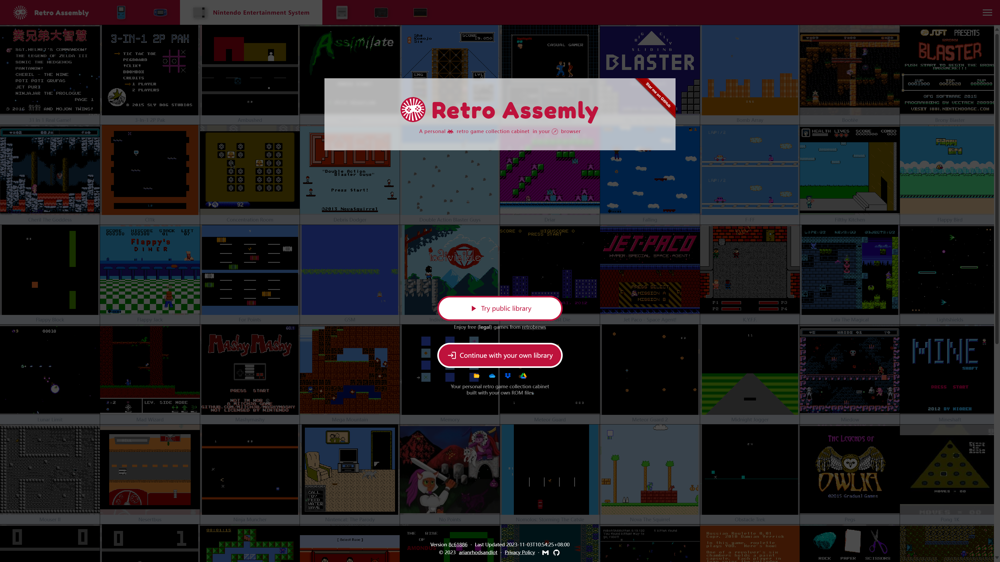
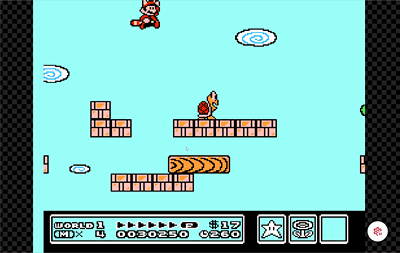
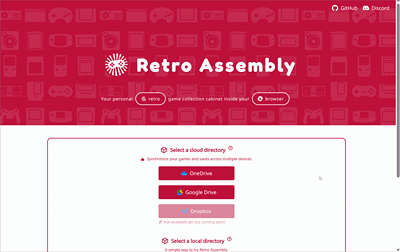

  

<h1 align="center">Retro Assembly</h1>

## Overview
A personal retro game collection cabinet in your browser.

## Usage
1. Visit [retroassembly.com](https://retroassembly.com).
2. Pick a method you prefer to provide your ROMs. For BIOS files, place them into a directory named `system` inside the directory you are picking.
3. Start to play!

## Features
|Description|Screenshot|
|---|---|
|📁 Import a directory from your OneDrive/Google Drive or disk, then a game list will appear||
|🖼️ Automatically grab game cover images||
|🎮 Joystick friendly, no need to switch between joysticks and mouse while navigating through different games or consoles ||
|⏳ Of course, rewinding||
|💾 Save states and sync them to with different devices (if using a cloud disk we support)||
|🗎 Play a single ROM file without initializing a game library||
|🍎 Super convenient for iOS/iPadOS, no AltStore/jailbreak required. Either play directly in your browser or add it to home screen. Notice: a joystick is necessary.  ||

## Supported Consoles
We support mainstream fourth-generation and earlier consoles as well as some handhelds. The detailed list is as follows.

<table>
  <thead>
    <tr>
      <th>Firm</th>
      <th>Platform</th>
      <th>Extension</th>
      <th>Emulator</th>
    </tr>
  </thead>
  <tbody>
    <tr>
      <td rowspan="3">Atari</td>
      <td>Atari - 2600</td>
      <td><code>.a26</code>, <code>.zip</code></td>
      <td>
        <b>Stella</b>
         
        <a href="https://github.com/libretro/stella-libretro">libretro core</a>,
        <a href="https://github.com/stella-emu/stella">origin</a>
      </td>
    </tr>
    <tr>
      <td>Atari - 5200</td>
      <td><code>.a52</code>, <code>.zip</code></td>
      <td>
        <b>Atari800</b>
         
        <a href="https://github.com/libretro/libretro-atari800">libretro core</a>,
        <a href="https://github.com/atari800/atari800">origin</a>
      </td>
    </tr>
    <tr>
      <td>Atari - 7800</td>
      <td><code>.a78</code>, <code>.zip</code></td>
      <td>
        <b>ProSystem</b>
         
        <a href="https://github.com/libretro/prosystem-libretro">libretro core</a>,
        <a href="https://github.com/gstanton/ProSystem1_3">origin</a>
      </td>
    </tr>
    <tr>
      <td rowspan="6">Nintendo</td>
      <td>Nintendo Entertainment System / Famicom</td>
      <td><code>.nes</code>, <code>.zip</code></td>
      <td>
        <b>FCEUmm</b>
         
        <a href="https://github.com/libretro/libretro-fceumm">libretro core</a>,
        <a href="https://sourceforge.net/projects/fceumm/">origin</a>
      </td>
    </tr>
    <tr>
      <td>Super Nintendo Entertainment System / Super Famicom</td>
      <td><code>.sfc</code>, <code>.smc</code>, <code>.zip</code></td>
      <td>
        <b>Snes9x</b>
         
        <a href="https://github.com/libretro/snes9x">libretro core</a>,
        <a href="https://github.com/snes9xgit/snes9x">origin</a>
      </td>
    </tr>
    <tr>
      <td>Game Boy Advanced</td>
      <td><code>.gbc</code>, <code>.zip</code></td>
      <td rowspan="3">
        <b>mGBA</b>
         
        <a href="https://github.com/libretro/mgba">libretro core</a>,
        <a href="https://github.com/mgba-emu/mgba">origin</a>
      </td>
    </tr>
    <tr>
      <td>Game Boy Color</td>
      <td><code>.gbc</code>, <code>.zip</code></td>
    </tr>
    <tr>
      <td>Game Boy</td>
      <td><code>.gb</code>, <code>.zip</code></td>
    </tr>
    <tr>
      <td>Virtual Boy</td>
      <td><code>.vb</code>, <code>.zip</code></td>
      <td>
        <b>Mednafen VB</b>
         
        <a href="https://github.com/libretro/beetle-vb-libretro">libretro core</a>,
        <a href="https://mednafen.github.io/">origin</a>
      </td>
    </tr>
    <tr>
      <td rowspan="3">Sega</td>
      <td>Master System / Mark III</td>
      <td><code>.sms</code>, <code>.zip</code></td>
      <td rowspan="3">
        <b>Genesis Plus GX</b>
         
        <a href="https://github.com/libretro/Genesis-Plus-GX">libretro core</a>,
        <a href="https://github.com/ekeeke/Genesis-Plus-GX">origin</a>
      </td>
    </tr>
    <tr>
      <td>Genesis / Mega Drive</td>
      <td><code>.md</code>, <code>.zip</code></td>
    </tr>
    <tr>
      <td>Game Gear</td>
      <td><code>.gg</code>, <code>.zip</code></td>
    </tr>
    <tr>
      <td rowspan="2">Bandai</td>
      <td>WonderSwan Color</td>
      <td><code>.wsc</code>, <code>.zip</code></td>
      <td rowspan="2">
        <b>Mednafen WonderSwan</b>
         
        <a href="https://github.com/libretro/beetle-wswan-libretro">libretro core</a>,
        <a href="https://mednafen.github.io/">origin</a>
      </td>
    </tr>
    <tr>
      <td>WonderSwan</td>
      <td><code>.ws</code>, <code>.zip</code></td>
    </tr>
    <tr>
      <td rowspan="2">SNK</td>
      <td>Neo Geo Pocket Color</td>
      <td><code>.ngc</code>, <code>.zip</code></td>
      <td rowspan="2">
        <b>Mednafen NGP</b>
         
        <a href="https://github.com/libretro/beetle-ngp-libretro">libretro core</a>,
        <a href="https://mednafen.github.io/">origin</a>
      </td>
    </tr>
    <tr>
      <td>Neo Geo Pocket</td>
      <td><code>.ngp</code>, <code>.zip</code></td>
    </tr>
    <tr>
      <td>-</td>
      <td>Arcade</td>
      <td><code>.zip</code></td>
      <td>
        <b>FBNeo</b>
         
        <a href="https://github.com/libretro/FBNeo">libretro core</a>,
        <a href="https://github.com/finalburnneo/FBNeo">origin</a>
      </td>
    </tr>
  </tbody>
</table>

Emulator are built based on RetroArch. See [Retro Assembly vendors](https://github.com/arianrhodsandlot/retro-assembly-vendors) for details.

## Development
It's quite easy to develop Retro Assembly. All we need is the latest [Node.js](https://nodejs.org) and [pnpm](https://pnpm.io).

Simply run `pnpm install` to setup dependencies, then run `pnpm dev` to launch the development server.

## Architecture
(Working in progress)

## Alternatives
+ [Afterplay.io](https://afterplay.io)
+ [Eclipse](https://eclipseemu.me)
+ [EmulatorJS](https://emulatorjs.org) [:octocat:](https://github.com/EmulatorJS/EmulatorJS)
+ [GamePlayColor](https://gameplaycolor.com) [:octocat:](https://github.com/gameplaycolor/gameplaycolor)
+ [RetroArch Web Player](https://web.libretro.com) [:octocat:](https://github.com/libretro/RetroArch/blob/master/pkg/emscripten/README.md)
+ [webrcade](https://www.webrcade.com) [:octocat:](https://github.com/webrcade/webrcade)
+ [webretro](https://binbashbanana.github.io/webretro/) [:octocat:](https://github.com/BinBashBanana/webretro)

## License
[MIT](license)
