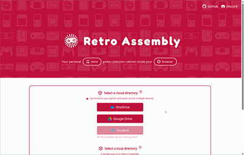
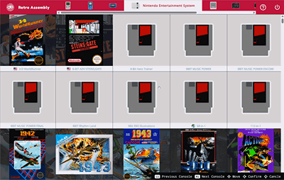
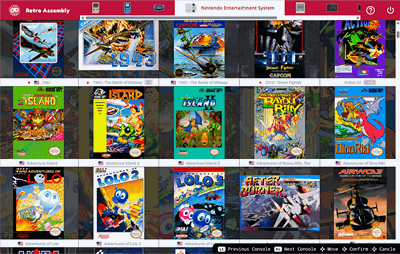
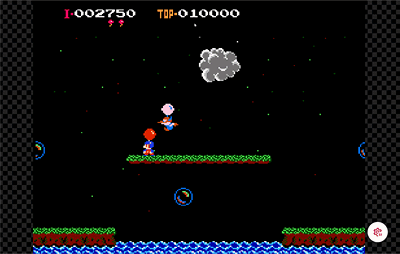

  

<h1 align="center">Retro Assembly</h1>

## Overview
Your personal retro game collection cabinet inside your browser.

## Usage
1. Visit [retro-assembly.pages.dev](https://retro-assembly.pages.dev)
2. Pick a method you prefer to provide your ROMs
3. Start to Play!

## Features
|Description|Screenshot|
|---|---|
|Import a directory from your OneDrive/Google Drive or disk, then a game list will appear||
|Automatically grab game cover images||
|Joystick friendly, no need to switch between joysticks and mouse while navigating through different games or consoles ||
|Of course, rewinding||
|Save states and sync them to with different devices (if using a cloud disk we support)||
|Play a single ROM file without initializing a game library||

## Supported Consoles
We support mainstream fourth-generation and earlier consoles as well as some handhelds. The detailed list is as follows.

### Home video game consoles
+  Atari - 2600
+  Nintendo - Nintendo Entertainment System / Famicom
+  Sega - Master System / Mark III
+  Sega - Genesis / Mega Drive
+  Nintendo - Super Nintendo Entertainment System / Super Famicom
### Handheld game consoles
+  Nintendo - Game Boy
+  Nintendo - Game Boy Color
+  Nintendo - Game Boy Advance
+  Sega - Game Gear
+  Nintendo - Virtual Boy

> ⚠️ As this project is still in an early stage, only some of the most popular consoles are supported.
> However, more consoles will be supported in the future.

## Alternatives
+ [EmulatorJS](https://emulatorjs.org) [:octocat:](https://github.com/EmulatorJS/EmulatorJS)
+ [RetroArchWebPlayer](https://web.libretro.com) [:octocat:](https://github.com/libretro/RetroArch/blob/master/pkg/emscripten/README.md)
+ [webrcade](https://www.webrcade.com) [:octocat:](https://github.com/webrcade/webrcade)
+ [webretro](https://binbashbanana.github.io/webretro/) [:octocat:](https://github.com/BinBashBanana/webretro)

## License
[MIT](license)
